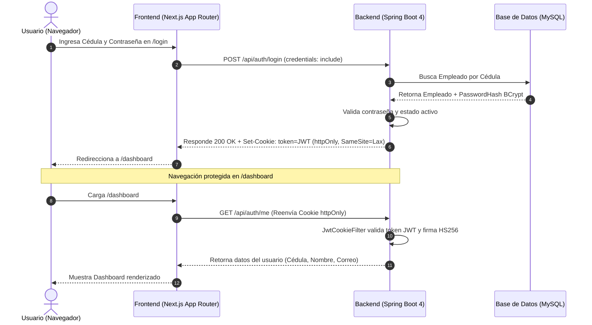
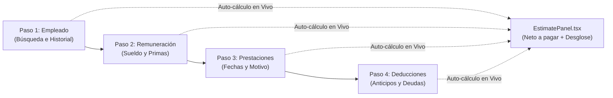
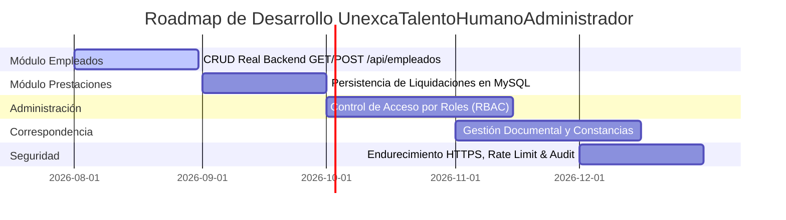

# Guía de Usuario y Especificación Técnica del Sistema
## UnexcaTalentoHumanoAdministrador

---

## Índice

1. [Visión General y Arquitectura](#1-visión-general-y-arquitectura)
   - 1.1 Contexto Institucional
   - 1.2 Stack Tecnológico
   - 1.3 Arquitectura de Seguridad y Flujo de Autenticación
2. [Funcionalidades Disponibles Actualmente](#2-funcionalidades-disponibles-actualmente)
   - 2.1 Módulo de Autenticación y Control de Sesión (Login / Logout)
   - 2.2 Panel Principal de Control (Dashboard)
   - 2.3 Módulo de Cálculo de Prestaciones Sociales (LOTTT)
3. [Manual de Operación Paso a Paso para el Usuario Final](#3-manual-de-operación-paso-a-paso-para-el-usuario-final)
   - 3.1 Inicio de Sesión
   - 3.2 Navegación por el Dashboard
   - 3.3 Realización de un Cálculo de Prestaciones en el Wizard
   - 3.4 Comparación de Escenarios y Descarga de Comprobante PDF
4. [Guía de Despliegue y Ejecución Local](#4-guía-de-despliegue-y-ejecución-local)
   - 4.1 Requisitos del Sistema
   - 4.2 Ejecución del Backend (Spring Boot 4)
   - 4.3 Ejecución del Frontend (Next.js 16)
   - 4.4 Credenciales de Prueba por Defecto
5. [Funcionalidades Futuras y Roadmap de Desarrollo](#5-funcionalidades-futuras-y-roadmap-de-desarrollo)
   - 5.1 Gestión de Empleados (CRUD Real en Backend)
   - 5.2 Persistencia Centralizada del Historial en BD
   - 5.3 Módulo de Administración y Control de Acceso por Roles (RBAC)
   - 5.4 Módulo de Correspondencia y Gestión Documental
   - 5.5 Endurecimiento de Seguridad para Producción
6. [Diseño de Interfaz de Usuario (UI/UX Design System)](#6-diseño-de-interfaz-de-usuario-uiux-design-system)
   - 6.1 Sistema de Tokens y Paleta de Colores
   - 6.2 Tipografía y Jerarquía Visual
   - 6.3 Componentes del Sistema de Diseño

---

## 1. Visión General y Arquitectura

### 1.1 Contexto Institucional
El sistema **UnexcaTalentoHumanoAdministrador** es una plataforma web desarrollada para automatizar y optimizar los procesos administrativos internos del Departamento de Talento Humano de la **UNEXCA (Universidad Nacional Experimental de la Gran Caracas)**.

El objetivo prioritario del sistema es eliminar la dependencia de hojas de cálculo manuales o herramientas externas no centralizadas, proporcionando un motor confiable para la simulación, cálculo y gestión de prestaciones sociales conforme a la **Ley Orgánica del Trabajo, los Trabajadores y las Trabajadoras (LOTTT)** y las normativas del Ministerio del Poder Popular para la Educación Universitaria de Venezuela.

### 1.2 Stack Tecnológico
El sistema está construido bajo una arquitectura desacoplada de 2 capas:

| Capa | Tecnología | Versión | Rol en el Sistema |
|---|---|---|---|
| **Backend** | Java / Spring Boot | Java 26 / Spring Boot 4.0.6 | API REST, motor de cálculo legal LOTTT, seguridad JWT y ORM JPA |
| **Frontend** | Next.js / React | Next.js 16.2 (App Router) / React 19 | Renderizado de interfaz (Server & Client Components), UX interactiva |
| **Estilos** | Tailwind CSS | v4 (`@tailwindcss/postcss`) | Sistema de tokens de diseño institucional, animaciones y layout |
| **Seguridad** | Nimbus JOSE JWT + BCrypt | 10.4 | Generación/firma HS256 de JWT en cookies `httpOnly` |
| **Base de Datos** | MySQL | Connector/J 9.x | Persistencia de datos de empleados y credenciales |

### 1.3 Arquitectura de Seguridad y Flujo de Autenticación



> [!IMPORTANT]
> **Frontera de Confianza**: La cookie de sesión `token` está configurada como `httpOnly`, lo que impide que cualquier código JavaScript en el cliente pueda leer o alterar el token JWT. El servidor Next.js actúa como proxy seguro para validar la sesión antes de renderizar páginas servidoras.

---

## 2. Funcionalidades Disponibles Actualmente

### 2.1 Módulo de Autenticación y Control de Sesión (Login / Logout)

- **Acceso por Cédula de Identidad**: El inicio de sesión se realiza mediante la Cédula (ej. `V-12345678`) y contraseña, adaptado al estándar del sector público venezolano.
- **Protección de Credenciales**: Hash de contraseñas mediante **BCrypt**.
- **Gestión de Errores Segura**: Mensajes de error genéricos que no revelan si una cédula existe o no en la base de datos (prevención de enumeración de usuarios).
- **Validación de Estatus de Empleado**: Si un empleado es marcado como `activo = false` en la base de datos, el sistema invalida inmediatamente sus intentos de inicio de sesión.
- **Cierre de Sesión (Logout)**: Limpia la cookie `httpOnly` en el backend (`POST /api/auth/logout`) y redirige automáticamente al login.

---

### 2.2 Panel Principal de Control (Dashboard)

El panel principal (`/dashboard`) está construido como un **Server Component protegido**:

1. **Barra de Navegación Lateral (Sidebar)**:
   - Identificador visual de la institución UNEXCA.
   - Perfil dinámico del usuario autenticado (Nombre completo y Cédula).
   - Acceso directo a módulos activos y botón de cierre de sesión.
2. **Resumen de Indicadores Clave (KPIs)**:
   - **Total de Empleados**: Conteo general registrado.
   - **Personal Docente / Profesorado**: Desglose de profesores.
   - **Personal Administrativo**: Desglose de personal de oficina.
   - **Solicitudes Pendientes**: Trámites en proceso.
3. **Accesos Rápidos a Módulos**:
   - Tarjeta interactiva hacia el **Módulo de Cálculo de Prestaciones Sociales**.
   - Tarjetas de módulos planificados (Administración y Correspondencia).
4. **Listado de Solicitudes Recientes**:
   - Muestra el historial reciente de operaciones con etiquetas de estado en color (`Completado`, `En Proceso`, `Pendiente`).

---

### 2.3 Módulo de Cálculo de Prestaciones Sociales (LOTTT)

Ubicado en `/dashboard/prestaciones`, este módulo constituye el núcleo de cálculo del sistema y cuenta con un **Wizard de 4 pasos con estimación en vivo**.



#### Características del Wizard:
1. **Paso 1: Datos del Empleado (`EmployeeSearch.tsx`)**
   - Buscador interactivo por nombre o cédula.
   - Selección automática del expediente: auto-completa Cédula, Cargo y Fecha de Ingreso.
2. **Paso 2: Remuneración (`MoneyInput.tsx`)**
   - Selector entre **Salario Fijo** o **Salario Variable**.
   - Campos monetarios con validación en tiempo real en Bolívares (`Bs.`): Sueldo Tabla, Primas, Promedio de los últimos 6 meses.
   - Configuración de Días de Bono Vacacional y Días de Aguinaldos/Utilidades.
3. **Paso 3: Prestaciones y Antigüedad**
   - Captura de **Fecha de Egreso / Liquidación**.
   - Selección del **Motivo de Terminación**:
     - *Renuncia Voluntaria*
     - *Despido Injustificado* (Genera Indemnización Art. 92 LOTTT)
     - *Retiro Justificado* (Genera Indemnización Art. 92 LOTTT)
     - *Causas Ajenas a la Voluntad*
   - Ingreso del **Histórico Acumulado** de garantía de prestaciones.
4. **Paso 4: Deducciones Legales**
   - Anticipos concedidos de prestaciones sociales.
   - Otras deudas (aplicando el **tope legal del 50%** sobre el neto a pagar).
   - Pensión alimentaria u orden judicial.

#### Motor de Cálculo Legal Backend (`PrestacionService.java`):
- **Salario Integral Diario**:
  $$\text{Salario Normal Diario} = \frac{\text{Salario Normal Mensual}}{30}$$
  $$\text{Alícuota Vacacional} = \frac{\text{Salario Normal Diario} \times \text{Días Bono Vacacional}}{360}$$
  $$\text{Alícuota Aguinaldos} = \frac{\text{Salario Normal Diario} \times \text{Días Aguinaldos}}{360}$$
  $$\text{Salario Integral Diario} = \text{Salario Normal Diario} + \text{Alícuota Vacacional} + \text{Alícuota Aguinaldos}$$

- **Garantía vs. Retroactivo (Art. 142 LOTTT)**:
  Compara el acumulado de garantía depositado vs. la antigüedad multiplicada por 30 días de salario integral diario por año trabajado (o fracción superior a 6 meses), aplicando el monto mayor a favor del trabajador.

- **Indemnización por Despido Injustificado (Art. 92 LOTTT)**:
  Duplica el monto base acumulado cuando el motivo de terminación corresponde a despido injustificado o retiro justificado.

---

## 3. Manual de Operación Paso a Paso para el Usuario Final

### 3.1 Inicio de Sesión
1. Abra el navegador web e ingrese a la dirección del sistema (por defecto `http://localhost:3000`).
2. En el formulario de autenticación:
   - Ingrese su **Cédula de Identidad** (Ejemplo: `V-12345678`).
   - Ingrese su **Contraseña**.
3. Haga clic en **Iniciar Sesión**. Si las credenciales son correctas, el sistema le redirigirá automáticamente al **Dashboard**.

---

### 3.2 Navegación por el Dashboard
1. **Panel Superior**: Visualice su nombre de usuario y rol en el menú lateral.
2. **Resumen de KPIs**: Consulte en tiempo real el total de personal activo en la UNEXCA.
3. **Módulos Disponibles**: Haga clic en la tarjeta **Cálculo de Prestaciones** para ingresar al asistente de liquidaciones.

---

### 3.3 Realización de un Cálculo de Prestaciones en el Wizard

#### Paso 1: Selección del Trabajador
1. En el campo de búsqueda, escriba la Cédula o Nombre del empleado.
2. Seleccione el trabajador del desplegable. El sistema cargará automáticamente su expediente (Cargo y Fecha de Ingreso).
3. Presione el botón **Siguiente**.

#### Paso 2: Configuración de Remuneración
1. Elija el tipo de salario (*Fijo* o *Variable*).
2. Introduzca los montos en Bolívares (`Bs.`):
   - **Sueldo Tabla / Base**.
   - **Primas Recibidas**.
   - Si es variable, introduzca el **Promedio de los últimos 6 meses**.
3. Verifique los días de Bono Vacacional y Aguinaldos según contrato colectivo.
4. Presione **Siguiente**.

#### Paso 3: Antigüedad y Motivo de Egreso
1. Seleccione la **Fecha de Egreso**.
2. Elija el **Motivo de Terminación** (ejemplo: *Renuncia* o *Despido Injustificado*).
3. Introduzca el **Histórico Acumulado** depositado en fideicomiso/contabilidad.
4. Presione **Siguiente**.

#### Paso 4: Aplicación de Deducciones y Cierre
1. Si existen anticipos recibidos, ingrese el monto en el campo **Anticipos**.
2. Si existen retenciones por deudas u orden judicial (pensión alimentaria), complételas.
3. Observe cómo el **Panel Lateral de Estimación** actualiza en tiempo real el neto a pagar.
4. Haga clic en **Calcular y Guardar** para registrar el resultado en el historial.

---

### 3.4 Comparación de Escenarios y Descarga de Comprobante PDF

1. **Comparar Escenarios**:
   - En el panel lateral, haga clic en el botón **Comparar Escenarios**.
   - El sistema recalculará automáticamente la liquidación bajo la alternativa opuesta (*Renuncia* ⇄ *Despido Injustificado*) mostrando la diferencia financiera en pantalla.
2. **Descargar PDF / Imprimir**:
   - Haga clic en el botón **Descargar PDF** en la barra de acciones.
   - Se abrirá la ventana oficial de impresión del navegador formateada como recibo institucional listo para firmar o guardar como PDF.

---

## 4. Guía de Despliegue y Ejecución Local

### 4.1 Requisitos del Sistema
- **Java Development Kit (JDK)**: Versión 26 o superior.
- **Node.js**: Versión 20.x o superior.
- **Gestor de Paquetes**: `npm` v10+ o `pnpm`.
- **Base de Datos**: MySQL 8.0+ escuchando en puerto 3306.

---

### 4.2 Ejecución del Backend (Spring Boot 4)
1. Navegue a la carpeta del backend:
   ```bash
   cd back
   ```
2. Inicie la aplicación con el wrapper de Gradle:
   ```bash
   ./gradlew bootRun
   ```
3. El servicio backend estará disponible en `http://localhost:8080`.
4. La documentación interactiva OpenAPI/Swagger estará accesible en `http://localhost:8080/swagger-ui.html`.

---

### 4.3 Ejecución del Frontend (Next.js 16)
1. Navegue a la carpeta del frontend:
   ```bash
   cd front
   ```
2. Instale las dependencias de Node:
   ```bash
   npm install
   ```
3. Inicie el servidor de desarrollo:
   ```bash
   npm run dev
   ```
4. Acceda desde el navegador a `http://localhost:3000`.

---

### 4.4 Credenciales de Prueba por Defecto
El sistema cuenta con un sembrador de datos de desarrollo (`DemoSeeder.java`) que inicializa un usuario administrador por defecto cuando la base de datos está vacía:

- **Cédula**: `V-12345678`
- **Contraseña**: `admin123`
- **Correo**: `admin@unexca.edu.ve`

---

## 5. Funcionalidades Futuras y Roadmap de Desarrollo

El sistema cuenta con una hoja de ruta estructurada para completar los módulos restantes y garantizar su preparación para producción:



### 5.1 Gestión de Empleados (CRUD Real en Backend)
- **Objetivo**: Conectar el formulario de búsqueda de empleados con la base de datos MySQL en lugar del archivo simulado `libs/empleados.ts`.
- **Endpoints a construir**:
  - `GET /api/empleados`: Listado paginado y filtro por cédula o nombre.
  - `POST /api/empleados`: Registro de nuevos trabajadores.
  - `PUT /api/empleados/{id}`: Actualización de datos de expediente.

### 5.2 Persistencia Centralizada del Historial en BD
- **Objetivo**: Reemplazar la memoria temporal `localStorage` por persistencia en MySQL.
- **Endpoints a construir**:
  - `POST /api/prestaciones/historial`: Guardado oficial del resultado de liquidación.
  - `GET /api/prestaciones/historial`: Consulta de liquidaciones históricas por empleado o rango de fechas.

### 5.3 Módulo de Administración y Control de Acceso por Roles (RBAC)
- **Objetivo**: Gestionar permisos granulares para el personal del departamento.
- **Roles Planificados**:
  - `ROLE_ADMIN`: Acceso total, gestión de usuarios, auditoría y parámetros globales.
  - `ROLE_ANALISTA_TH`: Capacidad de calcular liquidaciones y emitir constancias.
  - `ROLE_CONSULTOR`: Acceso en modo solo lectura a reportes e indicadores.

### 5.4 Módulo de Correspondencia y Gestión Documental
- **Objetivo**: Emisión, registro y seguimiento de documentos oficiales del departamento.
- **Funcionalidades**:
  - Generación automatizada de Constancias de Trabajo con código QR de verificación.
  - Registro de Memorandos e Informes Técnicos internos.
  - Trazabilidad de solicitudes y firma digital de aprobaciones.

### 5.5 Endurecimiento de Seguridad para Producción
- **Configuración HTTPS / TSL**: Habilitación del flag `Secure=true` en la cookie JWT.
- **Gestión de Secretos**: Extracción de contraseñas de BD y claves de firma JWT a variables de entorno de sistema (`ENV`).
- **Protección Anti Fuerza Bruta**: Rate-limiting en `/api/auth/login` (máximo de intentos fallidos por IP y Cédula).

---

## 6. Diseño de Interfaz de Usuario (UI/UX Design System)

### 6.1 Sistema de Tokens y Paleta de Colores
El diseño sigue una estética moderna, limpia e institucional basada en los tokens de **Tailwind CSS v4** definidos en `globals.css`:

```css
@theme {
  --color-brand-600: #1e40af; /* Azul Institucional Primario */
  --color-brand-700: #1d4ed8; /* Azul Interactivo Hover */
  --color-brand-300: #93c5fd; /* Azul de Enfoque y Acento */
  --color-canvas: #f8fafc;    /* Fondo Limpio General */
  --color-surface: #ffffff;   /* Superficie de Tarjetas y Modales */
  --color-ink: #0f172a;       /* Texto Principal de Alto Contraste */
  --color-ink-soft: #475569;  /* Texto Secundario y Etiquetas */
  --color-line: #e2e8f0;      /* Bordes y Separadores Finos */
}
```

### 6.2 Tipografía y Jerarquía Visual
- **Fuente Principal**: `Geist` (Vercel Font Family), optimizada para legibilidad en dashboards administrativos y datos numéricos salariales.
- **Jerarquía**:
  - *Títulos de Módulo*: 24px - Bold, tono `ink`.
  - *Subtítulos y Tarjetas*: 16px - SemiBold, tono `ink`.
  - *Etiquetas de Formularios*: 14px - Medium, tono `ink-soft`.
  - *Montos Monetarios*: Monospace / Numerals tabulares, destacados en `brand-600`.

### 6.3 Componentes del Sistema de Diseño

| Componente | Archivo Fuente | Descripción y Uso |
|---|---|---|
| **`DashboardShell`** | `_components/DashboardShell.tsx` | Envoltorio principal con layout responsive, barra superior y contenedor |
| **`Sidebar`** | `_components/Sidebar.tsx` | Menú lateral con navegación por módulos y tarjeta de perfil de usuario |
| **`Stepper`** | `prestaciones/_components/Stepper.tsx` | Indicador de pasos del wizard con estados: completado, activo e inactivo |
| **`MoneyInput`** | `prestaciones/_components/MoneyInput.tsx` | Campo con prefijo `Bs.`, formateo numérico y acotación a 2 decimales céntimos |
| **`EmployeeSearch`** | `prestaciones/_components/EmployeeSearch.tsx` | Buscador interactivo de trabajadores con tarjeta desplegable de preview |
| **`EstimatePanel`** | `prestaciones/_components/EstimatePanel.tsx` | Panel lateral sticky con resumen de monto neto y gráfico apilado por partidas |

---

> **Documento actualizado al:** 31 de julio de 2026  
> **Versión de Especificación:** 2.0 (Post-Refactor Módulo Prestaciones y Auditoría de Código)  
> **Proyecto:** UnexcaTalentoHumanoAdministrador
