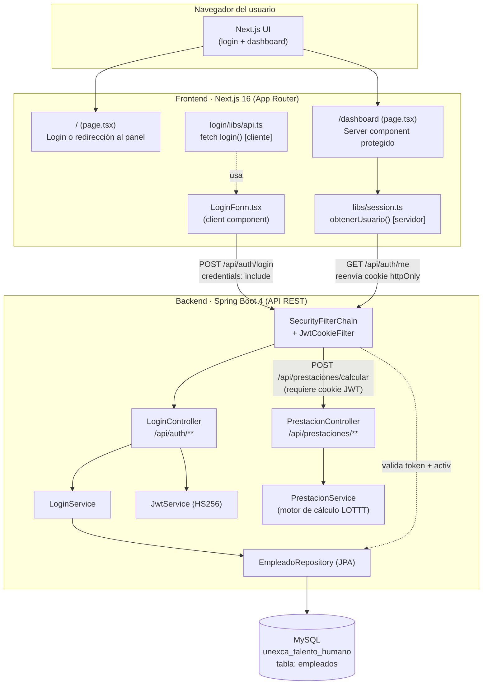
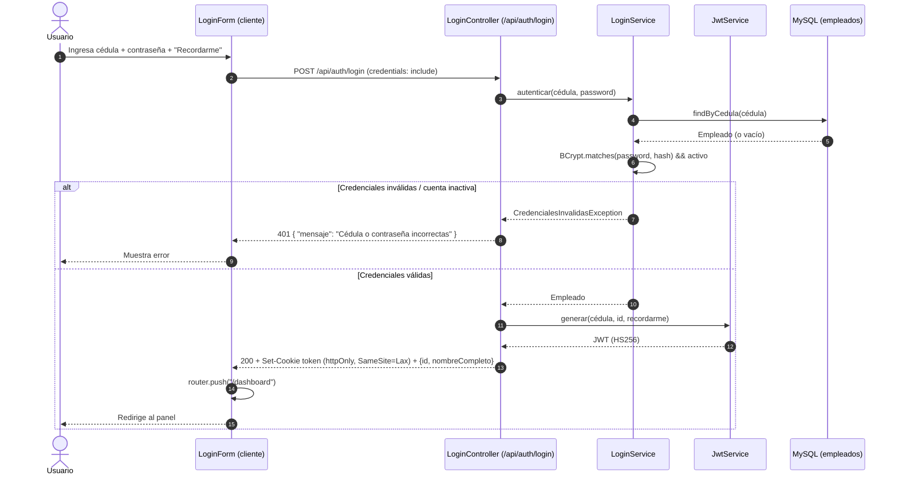
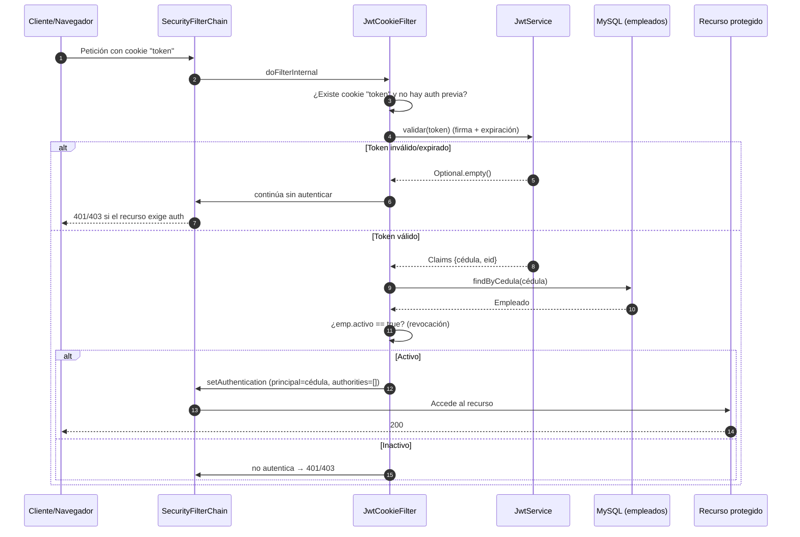
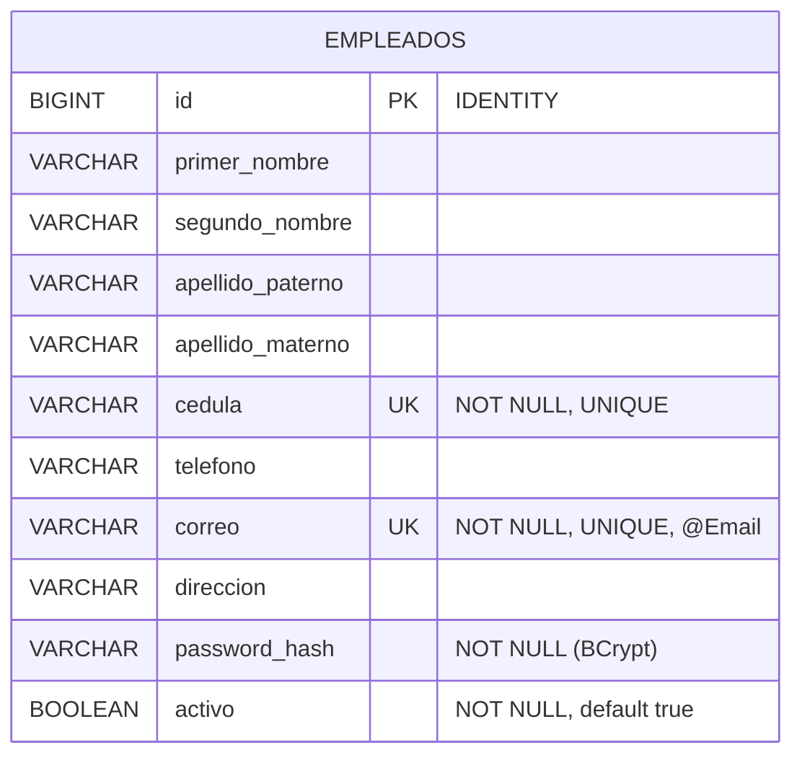

# Informe Técnico Completo: UnexcaTalentoHumanoAdministrador

---

## Portada

| Campo | Valor |
|---|---|
| **Proyecto** | UnexcaTalentoHumanoAdministrador |
| **Descripción** | Sistema de gestión para el departamento de Talento Humano de la UNEXCA |
| **Versión del código analizado** | `back` 0.0.1-SNAPSHOT · `front` 0.1.0 · rama `main` @ commit `335ff50` |
| **Fecha del informe** | 21 de julio de 2026 |
| **Versión del informe** | 2.0 |
| **Autor del análisis** | Claude Opus (arquitectura de software y seguridad) |
| **Alcance** | Análisis línea por línea del código fuente de backend (Spring Boot) y frontend (Next.js), evaluación de seguridad, deuda técnica y recomendaciones. Esta revisión incorpora el nuevo **módulo de Cálculo de Prestaciones Sociales** (backend). |
| **Audiencia** | Desarrolladores (~50%), arquitectos (~30%), stakeholders (~20%) |

> **Nota metodológica.** Este informe se elaboró leyendo directamente el código fuente del repositorio en `/home/rrichard/UnexcaTalentoHumanoAdministrador/`. Se verificaron **todos** los archivos fuente de `back/src` y `front/src` (no solo una muestra). Cuando una afirmación no pudo verificarse contra el código, se indica explícitamente con la etiqueta **[NO VERIFICADO]**. Los artefactos de build (`back/build`, `back/bin`, `front/.next`, `node_modules`) no forman parte del análisis por ser generados.

> **Cambios respecto a la v1.0.** Esta versión 2.0 refleja la incorporación del **módulo de Prestaciones** (`com.unexca.talentohumano.prestaciones`, commits `deb5f12` y `335ff50`, 3 archivos / 117 líneas): un motor de cálculo de prestaciones sociales conforme a la LOTTT venezolana. Se actualizaron el resumen ejecutivo, el estado de madurez (§1.4), la organización del código (§2.3), el inventario de endpoints (Apéndice A) y la sección de seguridad (§5); se añadieron la nueva **§3.6** (análisis línea por línea del módulo) y el **Apéndice H** (análisis normativo del cálculo, con la base legal y las brechas).

---

## Resumen Ejecutivo

**UnexcaTalentoHumanoAdministrador** es un sistema web en construcción para automatizar procesos administrativos del departamento de Talento Humano de la UNEXCA, con énfasis declarado en el cálculo de prestaciones sociales. La arquitectura separa un **backend** de API REST en Spring Boot 4 (Java 26) de un **frontend** en Next.js 16 (React 19, TypeScript, Tailwind CSS v4). Ambos se comunican mediante peticiones HTTP autenticadas por un **JSON Web Token (JWT) almacenado en una cookie `httpOnly`**.

En su estado actual, el proyecto tiene **dos módulos con lógica de negocio real: (1) autenticación (login/logout/sesión) y (2) cálculo de prestaciones sociales (backend)**. El de autenticación está construido con buenas prácticas de seguridad (contraseñas con BCrypt, cookie `httpOnly`, mensajes de error genéricos que no revelan la existencia de cuentas, y revocación efectiva al desactivar un empleado). El de **prestaciones** —incorporado en esta v2.0— es un motor de cálculo (`POST /api/prestaciones/calcular`) que codifica los pilares de la Ley Orgánica del Trabajo venezolana (LOTTT): salario integral, la regla del "mayor de" entre garantía y retroactivo, la indemnización por despido injustificado y las deducciones legales (ver §3.6 y Apéndice H). Los módulos restantes —Administración y Correspondencia— y la gestión de Empleados **existen únicamente como maquetas de interfaz con datos simulados (mock)** o como entidad sin CRUD; no hay lógica de negocio ni persistencia detrás de ellos. La entidad `Empleado` está modelada, pero no existe ningún CRUD para gestionarla salvo un sembrador de datos de demostración.

El módulo de prestaciones, aunque **funcional**, es aún una **calculadora pura**: recibe todas las cifras salariales en el cuerpo de la petición (no las obtiene de la BD, ni siquiera usa el `empleadoId` que recibe), no persiste el resultado ni deja rastro de auditoría, opera con aritmética de coma flotante (`double`) inadecuada para montos legales, y carece de validación de entrada y de control de acceso por rol. Estas limitaciones —junto con varias reglas normativas no cubiertas— se detallan en §3.6, §5, §6 y el Apéndice H, y deben resolverse antes de emitir liquidaciones oficiales.

Desde el punto de vista de **seguridad**, la postura del módulo de login es sólida en su diseño, pero **no está lista para producción** y presenta riesgos que deben resolverse antes de cualquier despliegue: la cookie se emite con `Secure=false` (transmisión en texto plano), existen un secreto JWT y una contraseña de base de datos **por defecto embebidos en el repositorio** cuya validación de arranque es insuficiente para impedir su uso accidental en producción, no hay protección contra fuerza bruta, y no se define control de acceso por roles (todo usuario autenticado tiene los mismos permisos). La recomendación central es tratar el módulo de autenticación como **maduro pero no endurecido para producción**, y priorizar (1) el endurecimiento de secretos y transporte, y (2) la construcción de los módulos de negocio sobre los cimientos de seguridad ya establecidos.

---

## 1. Contexto y Objetivos

### 1.1 ¿Qué es?

Según el `README.md` del repositorio, el sistema busca **automatizar procesos administrativos internos** del departamento de Talento Humano de la UNEXCA (Universidad Nacional Experimental de la Gran Caracas), reduciendo la dependencia de servicios externos, con foco especial en el **cálculo de prestaciones sociales** conforme a normativas del Ministerio de Educación (Venezuela).

### 1.2 Módulos previstos (según README)

1. **Login** — Control de acceso para personal autorizado. **[Implementado]**
2. **Cálculo de Prestaciones** — Automatización de cálculos legales. **[Implementado en backend: motor de cálculo LOTTT vía `POST /api/prestaciones/calcular`; sin interfaz de usuario, sin persistencia ni integración con el CRUD de empleados — ver §3.6 y Apéndice H]**
3. **Administración** — Gestión de datos y configuración. **[No implementado]**
4. **Correspondencia** — Seguimiento de documentos y comunicaciones. **[No implementado]**

### 1.3 ¿Para qué y por quién?

- **Usuarios finales:** personal administrativo del departamento de Talento Humano. La autenticación es por **cédula + contraseña** (no correo), lo cual encaja con el contexto venezolano y con un padrón de empleados internos.
- **Escala prevista:** el propio código de datos simulados sugiere una organización pequeña-mediana (KPIs de ejemplo: 248 profesores, 63 administrativos). No es un sistema masivo de cara al público.
- **Naturaleza de los datos:** información personal de empleados (PII) y, a futuro, cálculos salariales y de prestaciones. Esto eleva las exigencias de confidencialidad y auditoría.

### 1.4 Estado de madurez global

| Dimensión | Estado |
|---|---|
| Autenticación / sesión | ✅ Funcional |
| Gestión de empleados (CRUD) | ❌ Solo entidad + repositorio |
| Cálculo de prestaciones | ✅ Funcional (motor de cálculo backend; calculadora sin persistencia, validación ni UI — ver §3.6 y Apéndice H) |
| Administración / roles | ❌ Inexistente |
| Correspondencia | ❌ Inexistente |
| Panel (dashboard) UI | 🟡 Maqueta con datos simulados |
| Pruebas automatizadas | 🟡 2 clases de test unitario (solo login; **prestaciones sin pruebas**) |
| Preparación para producción | ❌ No |

---

## 2. Arquitectura General

### 2.1 Pila tecnológica (verificada)

**Backend** (`back/build.gradle`, `back/src`):

| Componente | Versión | Rol |
|---|---|---|
| Java (toolchain) | 26 | Lenguaje/runtime |
| Spring Boot | 4.0.6 | Framework de aplicación |
| Spring Security | (starter) | Cadena de filtros, autenticación |
| Spring Data JPA / Hibernate | (starter) | Persistencia ORM |
| Spring Modulith | 2.0.6 (BOM) | Modularización (ver §6: **no está en uso real**) |
| SpringDoc OpenAPI | 3.0.2 | Documentación Swagger UI |
| Nimbus JOSE + JWT | 10.4 | Firma/verificación de JWT (HS256) |
| MySQL Connector/J | runtime | Driver de base de datos |
| Spring Boot DevTools | dev | Recarga en caliente |
| GraalVM Native Buildtools | 0.11.5 | Compilación nativa (configurada, opcional) |
| Gradle Wrapper | 9.4.1 | Build |

**Frontend** (`front/package.json`):

| Componente | Versión | Rol |
|---|---|---|
| Next.js | 16.2.4 | Framework React (App Router) |
| React / React-DOM | 19.2.4 | UI |
| TypeScript | ^5 | Tipado estático |
| Tailwind CSS | ^4 | Estilos (vía `@tailwindcss/postcss`) |
| ESLint | ^9 + `eslint-config-next` | Linting |

> **Advertencia de versiones.** El archivo `front/AGENTS.md` señala explícitamente que esta versión de Next.js (16) "no es la que conoces" e incluye cambios de ruptura respecto a versiones anteriores; recomienda leer `node_modules/next/dist/docs/` antes de escribir código. Java 26 y Spring Boot 4.0.6 son igualmente muy recientes. Esto implica **riesgo de documentación escasa** y menor base de conocimiento comunitario.

### 2.2 Diagrama de componentes



### 2.3 Organización del código

**Backend** — paquetes bajo `com.unexca.talentohumano`:

```
talentohumano/
├── TalentoHumanoApplication.java     # Punto de entrada Spring Boot
├── config/
│   ├── SecurityConfig.java           # Cadena de filtros, CORS, CSRF, autorización
│   ├── AppBeans.java                 # Bean PasswordEncoder (BCrypt)
│   └── GlobalExceptionHandler.java   # Manejo de errores → JSON {mensaje}
├── login/
│   ├── LoginController.java          # /api/auth/{login,me,logout}
│   ├── LoginService.java             # Autenticación contra BD
│   ├── JwtService.java               # Generación/validación de JWT (HS256)
│   ├── JwtCookieFilter.java          # Filtro por-petición: lee cookie, autentica
│   ├── LoginRequest.java             # DTO entrada (record)
│   ├── LoginResponse.java            # DTO salida (record)
│   ├── MeResponse.java               # DTO sesión actual (record)
│   └── CredencialesInvalidasException.java
├── empleados/
│   ├── Empleado.java                 # Entidad JPA (tabla `empleados`)
│   └── EmpleadoRepository.java       # Repositorio JPA (findByCedula)
├── prestaciones/                     # NUEVO (v2.0) — motor de cálculo LOTTT
│   ├── PrestacionController.java     # POST /api/prestaciones/calcular
│   ├── PrestacionService.java        # Motor de cálculo (salario integral, garantía, indemnización)
│   └── DatosLiquidacionRequest.java  # DTO entrada (record, 14 campos)
└── dev/
    └── DemoSeeder.java               # Siembra empleado de prueba (condicional)
```

**Frontend** — bajo `front/src/app` (App Router):

```
app/
├── layout.tsx                        # Layout raíz (fuentes Geist, metadata)
├── globals.css                       # Tokens de marca Tailwind v4
├── page.tsx                          # Raíz "/": login o redirección a /dashboard
├── icon.svg / favicon.ico
├── login/
│   ├── page.tsx                      # Alias que redirige a "/"
│   ├── _components/LoginForm.tsx     # Formulario (client)
│   ├── _components/LoginForm.module.css
│   ├── libs/api.ts                   # Cliente fetch del login
│   └── types/auth.ts                 # Tipos LoginRequest/Response
└── dashboard/
    ├── page.tsx                      # Panel (server, protegido)
    ├── libs/session.ts               # obtenerUsuario() (servidor)
    ├── libs/data.ts                  # Datos SIMULADOS (KPIs, módulos, solicitudes)
    ├── types/dashboard.ts            # Tipos del panel
    └── _components/                  # DashboardShell, Sidebar, ResumenKpis,
                                      # AccesoRapido, SolicitudesRecientes, icons
```

### 2.4 Modelo cliente-servidor y frontera de confianza

- El **frontend** cumple dos roles: (a) *cliente* (el `LoginForm` corre en el navegador y hace `fetch` al backend con `credentials: "include"`), y (b) *servidor de renderizado* (los componentes de servidor `page.tsx` y `session.ts` corren en el proceso Node de Next.js y leen la cookie `httpOnly` para reenviarla al backend en `GET /api/auth/me`).
- La **única fuente de verdad de identidad** es el backend: el JWT lo firma y verifica el backend; el frontend nunca decodifica el token (no puede: es `httpOnly`).
- La frontera de confianza está en el backend. El frontend **no** debe considerarse confiable para autorización.

---

## 3. Análisis Línea por Línea (resumido)

Esta sección resume el comportamiento archivo por archivo, con observaciones técnicas puntuales. Las referencias de línea corresponden a los archivos verificados.

### 3.1 Backend — Autenticación

#### `SecurityConfig.java`
- Define un `SecurityFilterChain` con **sesión STATELESS** (no hay `HttpSession`), CORS habilitado, **CSRF deshabilitado**, y `JwtCookieFilter` insertado antes de `UsernamePasswordAuthenticationFilter`.
- **Rutas públicas** (`permitAll`): `/api/auth/**` (login, me, logout) y la documentación OpenAPI (`/v3/api-docs/**`, `/swagger-ui/**`). Todo lo demás exige autenticación.
- **CORS** (`corsConfigurationSource`): orígenes fijos `http://localhost:3000` y `http://localhost:3001`; métodos GET/POST/PUT/DELETE/PATCH/OPTIONS; **todas** las cabeceras (`*`); `allowCredentials=true`.
- **Observaciones:**
  - El comentario justifica desactivar CSRF por ser "API stateless con cookie `SameSite=Lax`". Es un argumento **defendible** (ver §5), pero el razonamiento solo se sostiene mientras la cookie sea `SameSite=Lax` **y** frontend y backend sean *same-site*.
  - Los orígenes CORS están **cableados a `localhost`**: no hay configuración por entorno para producción.
  - Marcar `permitAll` en `/api/auth/me` es correcto: el propio endpoint decide 401 si no hay sesión.
  - No se configuran cabeceras de seguridad explícitas (HSTS, CSP, etc.); se dependen de los valores por defecto de Spring Security (ver §5).

#### `JwtService.java`
- Firma tokens **HS256** (HMAC con secreto simétrico) usando Nimbus JOSE. `subject = cédula`, claim `eid = empleadoId`, con `issueTime`/`expirationTime`.
- `expMinutes=120` (2 h) por defecto; `expMinutesRecordarme=10080` (7 días) si "Recordarme".
- **`@PostConstruct validarSecreto()`**: falla el arranque si el secreto tiene < 32 bytes **o** contiene la cadena `"cambia-este-secreto"`.
- `validar()`: verifica firma **y** expiración; ante cualquier excepción devuelve `Optional.empty()` (falla cerrada — correcto).
- **Observaciones:**
  - HS256 es adecuado para un monolito (una sola app firma y verifica). No requiere claves asimétricas.
  - ⚠️ **La validación del secreto es insuficiente.** Solo rechaza la cadena literal `"cambia-este-secreto"`, pero el valor por defecto real en `application.properties` es `dev-only-secret-local-2026-unexca-talento-humano-32b` (50 bytes, sin esa subcadena) → **pasa la validación**. Un despliegue que olvide definir `APP_JWT_SECRET` arrancará con un secreto **público (está en el repositorio)**, permitiendo falsificar tokens. Ver hallazgo **S-2** en §5.
  - No hay `jti` (identificador de token) ni mecanismo de *refresh*; la revocación se logra por otra vía (ver `JwtCookieFilter`).

#### `JwtCookieFilter.java`
- Extiende `OncePerRequestFilter`. Busca la cookie `"token"`; si existe y aún no hay autenticación en el contexto, valida el token y luego **revalida contra la BD** que el empleado exista (`findByCedula`) y esté **activo**.
- Si todo pasa, coloca un `UsernamePasswordAuthenticationToken` con `emp.getCedula()` como *principal* y **lista de authorities vacía** (`List.of()`).
- **Observaciones:**
  - ✅ **Revocación efectiva:** al desactivar una cuenta (`activo=false`), sus tokens dejan de funcionar en la siguiente petición sin esperar a la expiración. Es una decisión de seguridad acertada.
  - ⚠️ **Costo:** implica una consulta a BD **en cada petición autenticada**. Aceptable a la escala prevista; a mayor escala convendría caché con invalidación.
  - ⚠️ **Authorities vacías:** no hay roles ni granularidad de permisos (ver §5, hallazgo S-7).

#### `LoginController.java` (`/api/auth`)
- `POST /login`: valida el `LoginRequest`, autentica vía `LoginService`, genera el JWT y lo emite en una **cookie `token`**: `httpOnly=true`, **`secure=false`**, `sameSite=Lax`, `path=/`, `maxAge = expSegundos` si "Recordarme" o `-1` (cookie de sesión) en caso contrario. Devuelve `LoginResponse{id, nombreCompleto}`.
- `GET /me`: resuelve el usuario autenticado desde el `Authentication`; 401 si no hay sesión o el empleado no existe/activo. Devuelve `MeResponse{id, nombreCompleto, cédula, correo, iniciales}`.
- `POST /logout`: emite cookie `token` vacía con `maxAge=0` → 204.
- **Observaciones:**
  - ⚠️ **`secure=false`** está marcado con comentario "poner true en producción (HTTPS)". Es un TODO crítico: hoy el token viaja en texto plano si se usa HTTP. Ver hallazgo **S-1**.
  - Construcción de nombre/iniciales con métodos `safe`/`inicial` null-safe — correcto y defensivo.
  - Buena separación: nunca se serializa la entidad `Empleado` completa hacia el cliente; solo DTOs (`LoginResponse`, `MeResponse`), evitando fugas de `passwordHash`.

#### `LoginService.java`
- `autenticar(cédula, password)`: `findByCedula` → verifica BCrypt (`passwordEncoder.matches`) → filtra `activo` → si algo falla lanza `CredencialesInvalidasException("Cédula o contraseña incorrectas")`.
- `porCedula(cédula)`: devuelve el empleado **activo** (para resolver la sesión en `/me`).
- **Observaciones:**
  - ✅ **Mensaje de error genérico e idéntico** para cédula inexistente, contraseña incorrecta y cuenta inactiva → previene *enumeración de usuarios*.
  - ⚠️ **Timing attack menor:** cuando la cédula no existe no se ejecuta BCrypt, por lo que la respuesta es más rápida que con cédula válida y contraseña incorrecta. Esto puede filtrar la existencia de una cédula por tiempo de respuesta. Riesgo bajo, pero conocido (se mitiga ejecutando un hash "dummy").

#### DTOs y excepción
- `LoginRequest` (record): `@NotBlank` en `cédula` y `password`; `recordarme` booleano.
- `LoginResponse` (record): `{id, nombreCompleto}`.
- `MeResponse` (record): `{id, nombreCompleto, cédula, correo, iniciales}`.
- `CredencialesInvalidasException` extends `RuntimeException`.
- `GlobalExceptionHandler`: mapea `CredencialesInvalidasException`→401 y `MethodArgumentNotValidException`→400, ambos como `{"mensaje": ...}`. Correcto y consistente con lo que el frontend espera.

### 3.2 Backend — Dominio

#### `Empleado.java` (entidad, tabla `empleados`)
- Campos: `id` (IDENTITY), `primerNombre`, `segundoNombre`, `apellidoPaterno`, `apellidoMaterno`, `cedula` (**unique, not null**), `telefono`, `correo` (**unique, not null, `@Email`**), `direccion`, `passwordHash` (not null), `activo` (not null, default `true`).
- **Observaciones:**
  - Nombres de columna explícitos salvo `passwordHash` y `activo` (usarán el *naming strategy* por defecto de Hibernate → `password_hash`, `activo`). Consistente pero conviene ser explícito.
  - No hay campos de auditoría (`createdAt`, `updatedAt`, `createdBy`), ni roles, ni fecha de ingreso/egreso, ni cargo/salario — datos necesarios para prestaciones (antigüedad). Por esta carencia, el nuevo módulo de prestaciones (§3.6) **no** obtiene sus insumos de esta entidad, sino del cuerpo de la petición.
  - `@Email` valida formato de correo a nivel de bean validation, pero **no se dispara** en el flujo actual (no hay endpoint que persista `Empleado` desde entrada de usuario; solo el seeder).

#### `EmpleadoRepository.java`
- `JpaRepository<Empleado, Long>` con un único método derivado: `findByCedula(String)`.
- **Observación:** minimalista y suficiente para el login. No hay métodos de listado/paginación/filtrado (aún no se necesitan).

#### `DemoSeeder.java`
- `@ConditionalOnProperty(app.seed-demo=true)` — **desactivado por defecto**. Crea el empleado `V-12345678` / `Unexca2026` (Ana María López Pérez) si no existe.
- **Observaciones:**
  - ✅ Condicional y idempotente. Bien acotado a desarrollo.
  - ⚠️ Credencial de demo **conocida y en el repositorio**: aceptable en dev, pero debe garantizarse que `app.seed-demo` **nunca** sea `true` en producción.
  - Es el **único** camino para crear usuarios hoy: no hay gestión de altas.

#### `application.properties`
- MySQL local `unexca_talento_humano` con `createDatabaseIfNotExist=true`.
- `DB_USERNAME:root`, **`DB_PASSWORD:1234`** (valor por defecto embebido).
- `spring.jpa.hibernate.ddl-auto=update`, `spring.jpa.show-sql=true`.
- `APP_JWT_SECRET` con valor por defecto embebido; `exp-minutes=120`; `exp-minutes-recordarme=10080`.
- `app.seed-demo=false` por defecto.
- **Observaciones:** ver hallazgos **S-2, S-3, S-5** en §5. `ddl-auto=update` y `show-sql=true` son inadecuados para producción.

### 3.3 Frontend — Login

#### `page.tsx` (raíz `/`)
- **Server component `async`**: si `obtenerUsuario()` devuelve sesión válida, `redirect("/dashboard")`; si no, renderiza `LoginForm`.
- Inyecta la fuente **Tektur** vía `<link>` a `fonts.googleapis.com` en tiempo de render.
- **Observaciones:**
  - ✅ Buen patrón: la protección/entrada se decide en el servidor antes de renderizar.
  - ⚠️ Cargar la fuente con `<link>` externo (en lugar de `next/font`) añade una **dependencia externa en tiempo de ejecución** (privacidad/latencia/CSP). Debería migrarse a `next/font`.

#### `login/_components/LoginForm.tsx` (client)
- Estado local para `cédula`, `password`, `recordarme`, `mostrar` (toggle de contraseña), `cargando`, `error`.
- `onSubmit`: valida no-vacío, llama a `login()`, y en éxito `router.push("/dashboard")`; captura el error y lo muestra.
- **Observaciones:**
  - ✅ Accesibilidad razonable (`aria-label` en toggle, `autoComplete` correcto).
  - UI de carga/errores adecuada. No hay validación de formato de cédula (podría añadirse).

#### `login/libs/api.ts`
- `login()` hace `POST /api/auth/login` con `credentials: "include"` (imprescindible para la cookie) y extrae `{mensaje}` del cuerpo de error.
- **Observación:** el `API` base sale de `NEXT_PUBLIC_API_URL` con *fallback* `http://localhost:8080`. Correcto.

#### `login/types/auth.ts` y `login/page.tsx`
- Tipos `LoginRequest`/`LoginResponse` alineados con el backend.
- `login/page.tsx` es un **alias** que `redirect("/")` — única fuente de verdad de la pantalla de login en la raíz.

### 3.4 Frontend — Dashboard

#### `dashboard/page.tsx` (server, protegido)
- Llama `obtenerUsuario()`; si no hay sesión, `redirect("/")`. Aplica la fuente **Inter** solo a este árbol. Renderiza `DashboardShell` con `ResumenKpis`, `AccesoRapido`, `SolicitudesRecientes` y una cabecera con fecha en `es-VE`.
- **Observaciones:**
  - ✅ **Doble protección de ruta**: raíz redirige al panel si hay sesión; panel redirige a la raíz si no la hay. Ambas decisiones en el servidor.
  - Todo el contenido de datos proviene de `libs/data.ts` (**simulado**), salvo el `usuario` real (de `/me`).

#### `dashboard/libs/session.ts`
- `obtenerUsuario()` (servidor): lee la cookie `httpOnly` `token` con `cookies()` y la **reenvía** a `GET /api/auth/me` con `cache: "no-store"`. Devuelve `UsuarioActual` o `null`.
- **Observación:** patrón correcto para leer una cookie `httpOnly` que el JS de cliente no puede ver. El `no-store` evita cachear identidad — acertado.

#### `dashboard/_components/DashboardShell.tsx` (client)
- Maneja el menú lateral móvil y el **cierre de sesión** (`POST /api/auth/logout` con `credentials:"include"`, luego `router.replace("/")` + `router.refresh()`).
- **Observación:** el logout debe ser del lado del cliente para que el navegador procese el `Set-Cookie` que borra la sesión — comentario correcto en el código.

#### `Sidebar.tsx`, `ResumenKpis.tsx`, `AccesoRapido.tsx`, `SolicitudesRecientes.tsx`, `icons.tsx`
- Presentacionales. `Sidebar` muestra el usuario real (nombre, correo, iniciales) y navegación (todos los `href="#"`, sin destino). Los KPIs, módulos ("Próximamente") y solicitudes salen de `data.ts`.
- `icons.tsx`: set de iconos SVG de línea (10 iconos) portados del diseño.
- **Observación:** UI pulida y coherente con tokens de marca, pero **inerte**: ninguna acción del panel conduce a funcionalidad real.

### 3.5 Frontend — Raíz / Layout / Estilos

- `layout.tsx`: layout raíz con fuentes **Geist**. ⚠️ La `metadata` conserva el *boilerplate* `title: "Create Next App"` / `description: "Generated by create next app"` — debe corregirse (ver §6).
- `globals.css`: define tokens de marca UNEXCA para Tailwind v4 (`--color-brand: #002e6b`, etc.). ⚠️ Conserva restos del *starter* (`--background/--foreground`, bloque `prefers-color-scheme: dark`, y `body { font-family: Arial }`) que conviven con los tokens de marca sin usarse plenamente — inconsistencia menor de higiene.
- `next.config.ts`: **vacío** — no define cabeceras de seguridad (`headers()`), reescrituras ni proxy.

### 3.6 Backend — Módulo de Prestaciones

> **Novedad v2.0.** Este módulo se incorporó en los commits `deb5f12` ("implementar motor de cálculo de prestaciones sociales LOTTT con deducciones legales") y `335ff50`. Reside en el paquete `com.unexca.talentohumano.prestaciones` y consta de **tres archivos (117 líneas)**: un `record` de entrada, un controlador REST y un servicio con el motor de cálculo. Es el **segundo módulo con lógica de negocio real** del sistema y materializa el objetivo declarado en el README (cálculo de prestaciones conforme a normativa venezolana). El análisis normativo detallado —qué reglas de la LOTTT se implementan y qué brechas quedan— se encuentra en el **Apéndice H**.

#### `DatosLiquidacionRequest.java` (record, 14 campos)
- `record` inmutable con los insumos del cálculo: `empleadoId`, `fechaIngreso`/`fechaEgreso` (`LocalDate`), `motivoTerminacion` (texto libre), `sueldoTabla`, `primas`, `esSalarioVariable`, `promedioSueldoUltimos6Meses`, `diasBonoVacacional`, `diasAguinaldos`, `historicoAcumulado`, `anticipos`, `otrasDeudas`, `pensionAlimentaria`.
- **Observaciones:**
  - ⚠️ **Sin validación de entrada.** No hay anotaciones de *bean validation* (`@NotNull`, `@Positive`, `@PastOrPresent`); todos los tipos son envoltorios *nullable* (`Double`, `Integer`, `LocalDate`) y el controlador **no** usa `@Valid`. Un cuerpo con campos ausentes provoca **`NullPointerException` por *unboxing*** dentro del servicio, que emerge como **HTTP 500** (no está mapeado por `GlobalExceptionHandler`). Ver hallazgo **S-13**.
  - ⚠️ **`empleadoId` se recibe pero nunca se usa.** El motor es una **calculadora pura**: no consulta la BD ni vincula el resultado a ningún empleado. Todas las figuras salariales las provee el cliente en el cuerpo (ver **S-14** y Apéndice H).
  - `motivoTerminacion` es **texto libre** (no un `enum`), lo que vuelve frágil la lógica de indemnización (ver servicio).
  - El nombre `DatosLiquidacionRequest` sugiere una *liquidación* completa, pero los campos y el cálculo cubren **solo prestaciones sociales** (+ indemnización), no vacaciones/bono/utilidades fraccionados pendientes (ver Apéndice H, H.2.4).

#### `PrestacionController.java` (`/api/prestaciones`)
- Controlador REST con un único endpoint: `POST /api/prestaciones/calcular`, que recibe `@RequestBody DatosLiquidacionRequest` y devuelve `ResponseEntity<Double>` con el monto neto.
- **Autorización (verificado contra `SecurityConfig`):** la ruta `/api/prestaciones/**` **no** figura en la lista `permitAll` (solo lo están `/api/auth/**` y la documentación OpenAPI); cae bajo `anyRequest().authenticated()`, por lo que **exige la cookie JWT válida**. ✅ Está protegido por autenticación.
- **Observaciones:**
  - ⚠️ **Sin control por roles.** Como `JwtCookieFilter` asigna *authorities* vacías (§3.1), **cualquier empleado autenticado** puede calcular la liquidación de **cualquier** persona con solo enviar sus cifras. Para un dato tan sensible como una liquidación laboral, la ausencia de roles (hallazgo **S-7**) deja de ser teórica y se vuelve material. Ver **S-14**.
  - ⚠️ **Respuesta como `Double` desnudo.** Devuelve un único número, sin desglose (salario integral, días computados, alícuotas, deducciones aplicadas). Para trazabilidad y auditoría legal se esperaría un DTO con el detalle del cálculo. Además, serializar un `double` arrastra el problema de precisión monetaria (ver **S-15**).
  - `@PostMapping` es adecuado (operación con cuerpo, no idempotente ni cacheable). El controlador es una fina fachada: delega toda la lógica en el servicio.

#### `PrestacionService.java` — motor de cálculo (líneas 10-72)
El método `calcularPrestacionesSociales(DatosLiquidacionRequest)` concentra toda la lógica de negocio. Recorrido por bloques:

1. **Antigüedad (líneas 12-17).** `Period.between(fechaIngreso, fechaEgreso)` descompone la antigüedad en `anos`/`meses`/`dias`; `totalMesesCompletos = anos*12 + meses`. ⚠️ Si las fechas son `null` → NPE; si `fechaEgreso < fechaIngreso`, `Period` produce componentes **negativos** y el resultado se corrompe silenciosamente (no hay validación de orden de fechas).

2. **Salario normal mensual (líneas 19-24).** Si `esSalarioVariable == TRUE` (comparación *null-safe* con `Boolean.TRUE.equals(...)`), usa `promedioSueldoUltimos6Meses`; en caso contrario, `sueldoTabla + primas`. ⚠️ En la rama variable, si `promedioSueldoUltimos6Meses` es `null` → NPE por *unboxing*; en la rama fija, si `sueldoTabla` o `primas` son `null` → NPE.

3. **Salario integral diario (líneas 26-30).** Núcleo normativo (LOTTT Art. 122):
   - `salarioNormalDiario = salarioNormalMensual / 30.0` (mes comercial de 30 días).
   - `alicuotaVacacional = (salarioNormalDiario * diasBonoVacacional) / 360.0` — alícuota diaria del bono vacacional.
   - `alicuotaAguinaldos = (salarioNormalDiario * diasAguinaldos) / 360.0` — alícuota diaria de aguinaldos/utilidades.
   - `salarioIntegralDiario = salarioNormalDiario + alicuotaVacacional + alicuotaAguinaldos`.
   - ✅ El uso de los divisores 30 (mes) y 360 (año comercial) es la convención estándar venezolana; este *salario integral* es la base correcta para prestaciones.

4. **Monto base de prestaciones (líneas 32-46).** Se bifurca en dos ramas:
   - **Rama A — antigüedad < 3 meses (líneas 34-36):** `mesesAPagar = totalMesesCompletos + (dias>0 ? 1 : 0)` (redondea hacia arriba el mes parcial); `montoBasePrestaciones = (mesesAPagar * 5) * salarioIntegralDiario`. Los **5 días por mes** equivalen a la **garantía** de 15 días por trimestre (LOTTT Art. 142.a).
   - **Rama B — resto (líneas 38-45):** `anosServicio = anos`, incrementado en 1 si `meses > 6` o (`meses == 6 && dias > 0`) → aplica la regla "fracción **superior** a seis meses se computa como un año" (Art. 142.c). Luego `retroactivo = (anosServicio * 30) * salarioIntegralDiario` (30 días por año sobre el último salario integral) y `montoBasePrestaciones = Math.max(historicoAcumulado, retroactivo)` → el trabajador recibe el **mayor** entre lo acumulado (garantía, Art. 142.a-b) y el retroactivo (Art. 142.d). ✅ Refleja fielmente el "mayor de" de la LOTTT.
   - ⚠️ **Brecha 3-6 meses:** para `anos == 0` y `meses` en [3, 6], la Rama B da `anosServicio = 0` → `retroactivo = 0` → `montoBase = historicoAcumulado`. Si `historicoAcumulado` es 0 (no se lleva registro externo), el trabajador obtiene **0** pese a haber generado garantía. El motor **no** calcula por sí mismo la acumulación de la garantía (Art. 142.a-b) para el rango de 3 a 12 meses: la delega enteramente en el insumo `historicoAcumulado`. Detalle en Apéndice H (H.2.2).

5. **Indemnización doble (líneas 48-57).** `motivo = motivoTerminacion.toUpperCase()` (null-safe); si pertenece al conjunto `{"DESPIDO INJUSTIFICADO", "RETIRO JUSTIFICADO", "CAUSAS AJENAS"}` → `montoBasePrestaciones *= 2`. ✅ Implementa la indemnización del Art. 92 LOTTT (monto igual al de las prestaciones). ⚠️ El *match* es por **texto exacto** sobre un campo libre: cualquier variación ("DESPIDO SIN JUSTA CAUSA", sinónimos, texto adicional) **no** duplica. Debería tipificarse con un `enum` de causales.

6. **Deducciones (líneas 59-69).**
   - `netoAPagar = montoBase - anticipos` (con *fallback* 0 si `anticipos` es null).
   - `otrasDeudas`: se calcula el tope `limiteDescuentoDeudas = netoAPagar * 0.50` y se descuenta `min(otrasDeudas, tope)` → **máximo 50 %** del neto (interpretación de los límites de deducción, Art. 154 LOTTT).
   - `pensionAlimentaria`: se descuenta **íntegra, sin tope alguno**.
   - ⚠️ **Sin piso en cero:** si las deducciones superan la base, `netoAPagar` puede quedar **negativo** (falta un `Math.max(0, …)`).
   - ⚠️ **El orden importa:** los anticipos se restan **antes** de calcular el tope del 50 %, y la pensión alimentaria se resta al final sin límite; la base sobre la que aplica el tope del 50 % depende de ese orden de operaciones.

7. **Retorno (línea 71).** `return netoAPagar;` de tipo `double`. ⚠️ **Toda la aritmética monetaria es en coma flotante (`double`)**, inadecuado para montos legales: introduce errores de redondeo acumulativos y no permite reglas de redondeo a céntimos reproducibles. Debería migrarse a `BigDecimal` con `RoundingMode` explícito. Ver **S-15**.

**Síntesis del módulo.** Motor **funcional** que codifica correctamente los pilares de la LOTTT (salario integral, "mayor de" garantía/retroactivo, fracción superior a 6 meses, indemnización del Art. 92 y topes de deducción). Sus limitaciones —ausencia de validación, `double` para dinero, sin persistencia ni auditoría, sin control por rol, cifras provistas por el cliente, brecha en el rango 3-6 meses y varias reglas normativas no cubiertas— se detallan en §5 (seguridad), §6 (deuda técnica) y el **Apéndice H** (análisis normativo).

---

## 4. Flujos Principales

### 4.1 Flujo de Login (inicio de sesión)



### 4.2 Flujo de Autenticación por petición (filtro)



### 4.3 Flujo de Sesión (resolución de identidad y protección de rutas)

```mermaid
sequenceDiagram
    autonumber
    actor U as Usuario
    participant N as Next.js (servidor)
    participant SS as session.ts (obtenerUsuario)
    participant B as /api/auth/me
    participant DB as MySQL

    U->>N: GET /dashboard
    N->>SS: obtenerUsuario()
    SS->>SS: lee cookie httpOnly "token" (cookies())
    alt Sin cookie
        SS-->>N: null
        N-->>U: redirect("/")  (a login)
    else Con cookie
        SS->>B: GET /api/auth/me (reenvía cookie, no-store)
        B->>DB: (vía filtro) valida token + activo
        alt Sesión válida
            B-->>SS: 200 MeResponse {id, nombre, cédula, correo, iniciales}
            SS-->>N: UsuarioActual
            N-->>U: Renderiza el panel con datos del usuario
        else Sesión inválida
            B-->>SS: 401
            SS-->>N: null
            N-->>U: redirect("/")
        end
    end
```



### 4.4 Modelo de datos (estado actual)



> El esquema lo genera Hibernate (`ddl-auto=update`). **Hoy solo existe la tabla `empleados`.** El módulo de prestaciones (§3.6) es un **motor sin estado**: calcula a partir del cuerpo de la petición y **no persiste nada** (no hay tabla de liquidaciones, insumos ni auditoría — ver Apéndice H, H.2.8). Los módulos de correspondencia y administración tampoco tienen tablas.

---

## 5. Seguridad

### 5.1 Postura de seguridad actual (síntesis)

El módulo de autenticación demuestra **conciencia de seguridad por encima del promedio** para un proyecto en etapa temprana. Se evidencian decisiones deliberadas y bien comentadas: hashing con BCrypt, cookie `httpOnly` (mitiga robo de token por XSS), `SameSite=Lax` (mitiga CSRF), mensajes de error genéricos (previenen enumeración de usuarios), revocación por estado `activo`, y sesiones *stateless*. El historial de git incluso muestra un commit `fix(back/login): harden auth per security review`, señal de un ciclo de revisión previo.

Sin embargo, **el sistema no está listo para producción**. Los riesgos se concentran en configuración/despliegue (secretos y transporte) y en ausencias (fuerza bruta, roles, auditoría). A continuación, los hallazgos priorizados.

El nuevo **módulo de prestaciones** (§3.6) hereda la postura "autenticado pero sin roles" y añade superficie propia: al no validar la entrada puede degradarse a HTTP 500 ante cuerpos malformados (**S-13**), y —por tratar un dato altamente sensible (una liquidación laboral) accesible a **cualquier** usuario autenticado, sin persistencia ni auditoría y con cifras provistas por el cliente— eleva la importancia práctica del control de acceso por rol (**S-14**, que refuerza a **S-7**).

### 5.2 Hallazgos priorizados

| ID | Severidad | Hallazgo | Ubicación |
|---|---|---|---|
| **S-1** | 🔴 Crítica | Cookie de sesión con `Secure=false`: el JWT viaja en texto plano sobre HTTP | `LoginController.java` (login) |
| **S-2** | 🔴 Crítica | Secreto JWT por defecto embebido en el repo; la validación de arranque **no** lo bloquea | `application.properties`, `JwtService.validarSecreto()` |
| **S-3** | 🔴 Crítica | Contraseña de BD por defecto (`1234`) embebida | `application.properties` |
| **S-4** | 🟠 Alta | Sin límite de intentos / bloqueo de cuenta (fuerza bruta y *credential stuffing*) | `LoginService`/`LoginController` |
| **S-5** | 🟠 Alta | `ddl-auto=update` y `show-sql=true` inadecuados para producción | `application.properties` |
| **S-6** | 🟠 Alta | Sin cabeceras de seguridad explícitas (HSTS, CSP); dependencia de defaults | `SecurityConfig`, `next.config.ts` |
| **S-7** | 🟡 Media | Sin control de acceso por roles: todo usuario autenticado tiene los mismos permisos (`authorities=[]`). Agravado por prestaciones (ver S-14) | `JwtCookieFilter`, `SecurityConfig` |
| **S-8** | 🟡 Media | Sin auditoría de accesos (login exitoso/fallido, logout) | Transversal |
| **S-9** | 🟡 Media | JWT sin `jti` ni *refresh*; token "Recordarme" de 7 días solo revocable por `activo` | `JwtService` |
| **S-10** | 🟢 Baja | CORS cableado a `localhost`; `allowedHeaders("*")` con credenciales | `SecurityConfig` |
| **S-11** | 🟢 Baja | Posible *timing attack* (BCrypt no se ejecuta si la cédula no existe) | `LoginService.autenticar` |
| **S-12** | 🟢 Baja | Fuente cargada desde `fonts.googleapis.com` en runtime (privacidad/CSP) | `app/page.tsx` |
| **S-13** | 🟠 Alta | Endpoint de prestaciones **sin validación de entrada**: un cuerpo con campos nulos/ausentes provoca `NullPointerException` → **HTTP 500** no controlado (robustez / DoS trivial) | `DatosLiquidacionRequest`, `PrestacionController` |
| **S-14** | 🟡 Media | Cálculo de liquidación (dato sensible) accesible a **cualquier** usuario autenticado, sin rol, con cifras provistas por el cliente (`empleadoId` ignorado) y **sin persistencia ni auditoría** del resultado | `PrestacionController`, `PrestacionService` |
| **S-15** | 🟢 Baja | Montos monetarios en `double` (coma flotante): errores de redondeo en un cálculo con efectos legales | `PrestacionService` |

### 5.3 Detalle y recomendaciones de los hallazgos críticos

**S-1 · Cookie `Secure=false`.** Hoy la cookie `token` puede transmitirse por HTTP sin cifrar, exponiéndola a interceptación (MITM). El código lo reconoce con `// poner true en producción`.
→ **Recomendación:** externalizar el flag (`app.cookie.secure=${COOKIE_SECURE:false}`) y forzar `true` en producción tras servir todo por HTTPS/TLS. Añadir HSTS (S-6).

**S-2 · Secreto JWT por defecto embebido.** El valor `dev-only-secret-local-2026-unexca-talento-humano-32b` está en el repositorio y **supera** la validación (≥32 bytes y sin la subcadena `"cambia-este-secreto"`). Si producción arranca sin `APP_JWT_SECRET`, cualquiera con acceso al repo puede **firmar tokens válidos** y suplantar a cualquier empleado.
→ **Recomendación:** (a) endurecer `validarSecreto()` para rechazar también el valor de desarrollo conocido (o exigir que el secreto **no** provenga del valor por defecto en el perfil `prod`); (b) mejor aún, **no** proveer valor por defecto en producción: usar perfiles Spring (`application-prod.properties`) sin *fallback*, de modo que la app **falle al arrancar** si el secreto no está definido; (c) rotar el secreto (invalida todos los tokens).

**S-3 · Contraseña de BD por defecto.** `DB_PASSWORD:1234` como *fallback*. Aunque el commit `chore(security): externalize DB credentials` externalizó el valor, el *fallback* embebido sigue siendo un riesgo si el entorno no define la variable.
→ **Recomendación:** eliminar el *fallback* en el perfil de producción; que la app falle si `DB_PASSWORD` no está definido. Rotar la contraseña real.

### 5.4 Aspectos de seguridad bien resueltos (a preservar)

- ✅ **BCrypt** para contraseñas (algoritmo adaptativo, con *salt* por hash).
- ✅ **Cookie `httpOnly`** — el token no es accesible desde JS, mitigando robo por XSS.
- ✅ **`SameSite=Lax`** — mitiga CSRF sin necesidad de tokens anti-CSRF (justifica el `csrf.disable()`).
- ✅ **Mensajes de error genéricos** — no revelan si la cuenta existe o está inactiva.
- ✅ **Revocación por `activo`** en cada petición — desactivar una cuenta corta el acceso de inmediato.
- ✅ **Sesiones STATELESS** — sin estado de sesión en servidor, escalable horizontalmente.
- ✅ **DTOs de salida** — nunca se serializa la entidad `Empleado` (evita fuga de `passwordHash`).
- ✅ **`app.seed-demo=false`** por defecto — el usuario de demostración no se crea salvo activación explícita.

### 5.5 Nota sobre CSRF y `SameSite`

Desactivar CSRF es **aceptable hoy** porque: (1) la autenticación es por cookie `SameSite=Lax`, que el navegador **no** envía en peticiones POST *cross-site*; y (2) frontend (`localhost:3000/3001`) y backend (`localhost:8080`) son *same-site* (mismo `localhost`; el puerto no afecta la condición *same-site*). **Advertencia para producción:** si el frontend y el backend quedaran en **dominios distintos** (no *same-site*), la cookie `SameSite=Lax` **dejaría de enviarse** en las peticiones del frontend y la app se rompería; habría que usar `SameSite=None; Secure` y **reactivar CSRF** o adoptar otro esquema (p. ej. token en cabecera). Esta decisión arquitectónica debe tomarse antes del despliegue.

---

## 6. Deuda Técnica y Brechas

### 6.1 Funcionalidad ausente (brechas de producto)

1. **2 de 4 módulos de negocio no existen; el de prestaciones existe pero incompleto.** Administración y Correspondencia son solo tarjetas "Próximamente". El **Cálculo de Prestaciones** —objetivo central del sistema— ya tiene un motor backend funcional (§3.6), pero **sin interfaz de usuario, sin persistencia/auditoría, sin integración con el CRUD de empleados** (recibe las cifras por el cuerpo e ignora `empleadoId`) y con varias reglas normativas pendientes (Apéndice H). El panel sigue mostrándolo como "Próximamente".
2. **Sin CRUD de empleados.** Existe la entidad y el repositorio, pero no hay endpoints para crear/editar/listar/desactivar empleados. El único alta posible es vía `DemoSeeder`. Esta ausencia bloquea que el motor de prestaciones obtenga los insumos salariales de una fuente de verdad.
3. **Sin gestión de contraseñas.** No hay cambio de contraseña, recuperación, ni política de complejidad/expiración.
4. **Panel con datos 100% simulados.** KPIs, módulos y solicitudes provienen de `dashboard/libs/data.ts`; ninguna cifra es real.
5. **Navegación inerte.** Todos los enlaces del `Sidebar` y del panel apuntan a `#`.

### 6.2 Deuda técnica (calidad interna)

| Ítem | Descripción | Impacto |
|---|---|---|
| **Spring Modulith declarativo pero no usado** | La dependencia está en `build.gradle`, pero **no hay** `@ApplicationModule`, `package-info.java` ni test de modularidad (`ApplicationModules.verify()`). Los "módulos" son solo paquetes convencionales. | Se paga el peso de la dependencia sin obtener verificación de límites. |
| **Boilerplate del *starter*** | `layout.tsx` mantiene `title: "Create Next App"`; `globals.css` conserva variables/dark-mode del *starter* y `body{font-family:Arial}`. | Metadata incorrecta de cara al usuario y al SEO; inconsistencia de estilos. |
| **Borrador muerto** | `back/boceto-login/loginService.java.txt` es un stub roto (cuerpo vacío en `login()`, falta `;`, referencia `findByEmail`/`setLoggedIn` inexistentes). | Confusión; código muerto en el repo. |
| **Pruebas escasas** | Solo `JwtServiceTest` y `LoginServiceTest` (unitarias). **No hay** pruebas de `LoginController`, del `JwtCookieFilter`, de integración con Spring Security, ni pruebas de frontend. | Baja red de seguridad ante cambios. |
| **Config de un solo entorno** | Un único `application.properties` con *fallbacks*; sin perfiles `dev`/`prod`. | Riesgo de arrastrar defaults de dev a producción (ver S-2/S-3/S-5). |
| **Sin cabeceras de seguridad** | `next.config.ts` vacío; `SecurityConfig` no configura `headers()`. | Falta HSTS/CSP/etc. |
| **Sin campos de auditoría/dominio en `Empleado`** | No hay `createdAt`, fechas de ingreso/egreso, ni cargo/salario. | El motor de prestaciones no puede leer sus insumos de la BD; hoy dependen del cuerpo de la petición. |
| **Prestaciones: aritmética en `double`** | El motor calcula montos legales con coma flotante en vez de `BigDecimal`. | Errores de redondeo; cálculo no reproducible a céntimos (S-15). |
| **Prestaciones: sin validación ni desglose** | Sin *bean validation* en la entrada; respuesta como `Double` desnudo. | HTTP 500 ante cuerpos malformados (S-13); sin trazabilidad del cálculo. |
| **Prestaciones: sin persistencia ni auditoría** | El motor no guarda insumos, resultado, autor ni fecha del cálculo. | Sin rastro para auditoría/contencioso de una liquidación con efectos legales. |
| **Prestaciones: causales como texto libre** | `motivoTerminacion` se compara por texto exacto en mayúsculas. | La indemnización (Art. 92) no se aplica ante variaciones de redacción; debería ser `enum`. |
| **Fuente externa en runtime** | Tektur vía `<link>` a Google Fonts en `page.tsx`. | Latencia/privacidad/CSP; debería usar `next/font`. |

### 6.3 Brechas operativas (DevOps)

- **Sin CI/CD** verificable en el repo.
- **Sin Dockerfile / manifiestos de despliegue** (aunque hay soporte GraalVM nativo configurado). **[NO VERIFICADO más allá de la ausencia de archivos]**
- **Sin observabilidad**: no se incluye Spring Boot Actuator, métricas ni configuración de logging estructurado.
- **Sin migraciones de esquema** (Flyway/Liquibase); se depende de `ddl-auto=update`, que no es seguro para evolucionar esquemas en producción.
- **Sin estrategia de *backup*/retención** de la BD documentada.

---

## 7. Recomendaciones Priorizadas

Roadmap sugerido en tres olas. Cada ítem indica el/los hallazgos o brechas que resuelve.

### Ola 1 — Endurecimiento para producción (bloqueante antes de cualquier despliegue)

1. **Perfiles de Spring (`dev`/`prod`)** y eliminación de *fallbacks* de secretos en `prod`. La app debe **fallar al arrancar** si faltan `APP_JWT_SECRET`, `DB_PASSWORD`. *(S-2, S-3, S-5)*
2. **HTTPS + `Secure=true`** en la cookie, externalizando el flag por entorno. *(S-1)*
3. **Cabeceras de seguridad**: HSTS y `Content-Security-Policy` (esta última permitiría además controlar la fuente externa de Google Fonts), `X-Content-Type-Options`, etc., tanto en Spring (`http.headers(...)`) como en `next.config.ts` (`headers()`). *(S-6, S-12)*
4. **`ddl-auto=validate`** en producción + introducir **Flyway/Liquibase** para migraciones versionadas. *(S-5, §6.3)*
5. **Rate limiting / bloqueo temporal** de intentos de login (por IP y por cédula). *(S-4)*
6. **CORS por entorno** (orígenes reales de producción, no `localhost`). *(S-10)*

### Ola 2 — Cimientos de dominio y control de acceso

7. **Modelo de roles/authorities** (`ROLE_ADMIN`, `ROLE_RRHH`, etc.) incluido en el JWT y aplicado con `@PreAuthorize`/`authorizeHttpRequests`, especialmente para el módulo de Administración. *(S-7)*
8. **CRUD de empleados** (altas, edición, desactivación) con validación (`@Email`, formato de cédula) y paginación.
9. **Gestión de contraseñas**: cambio obligatorio en primer ingreso, política de complejidad y flujo de recuperación.
10. **Auditoría**: registrar login exitoso/fallido, logout y cambios sensibles (tabla de auditoría o log estructurado). *(S-8)*
11. **Campos de dominio en `Empleado`**: cargo, fecha de ingreso, salario base, y auditoría (`createdAt`/`updatedAt`) — prerrequisito para prestaciones.

### Ola 3 — Módulos de negocio y calidad

12. **Endurecer el módulo de Cálculo de Prestaciones** (ya existe un motor funcional, §3.6): (a) migrar la aritmética a `BigDecimal` con redondeo explícito *(S-15)*; (b) añadir *bean validation* (`@Valid`, `@NotNull`, `@PastOrPresent`, orden de fechas) y devolver un DTO con **desglose** del cálculo *(S-13)*; (c) tipificar `motivoTerminacion` como `enum`; (d) cubrir la **brecha 3-12 meses** de la garantía (Apéndice H, H.2.2) y las reglas normativas faltantes (intereses Art. 143, conceptos fraccionados); (e) **persistir** insumos, resultado, autor y fecha con auditoría *(S-14)*; (f) obtener los insumos salariales del CRUD de empleados en vez del cuerpo; (g) restringir por **rol** (RRHH) *(S-7)*; (h) **pruebas exhaustivas con casos oficiales** por su criticidad legal, y **validación jurídica** de las reglas (Apéndice H); (i) construir la **interfaz de usuario** del módulo.
13. **Módulo de Correspondencia** y **Administración**.
14. **Conectar el panel a datos reales** (reemplazar `data.ts`).
15. **Cobertura de pruebas**: tests de controlador e integración (`@SpringBootTest` + `spring-security-test`), test del `JwtCookieFilter`, verificación de modularidad de Spring Modulith (`ApplicationModules.verify()`), y pruebas de frontend (al menos del flujo de login).
16. **Observabilidad**: Actuator + métricas + logging estructurado; **DevOps**: Dockerfile, pipeline CI/CD, *backups*.
17. **Higiene**: corregir metadata `layout.tsx`, limpiar `globals.css`, eliminar `boceto-login/loginService.java.txt`, migrar fuentes a `next/font`. *(§6.2)*

### Matriz esfuerzo/impacto (orientativa)

| Recomendación | Impacto | Esfuerzo |
|---|---|---|
| Perfiles + secretos obligatorios (1) | Muy alto | Bajo |
| HTTPS + Secure cookie (2) | Muy alto | Bajo-medio |
| Rate limiting (5) | Alto | Medio |
| Roles/authorities (7) | Alto | Medio |
| Migraciones Flyway (4) | Alto | Medio |
| Endurecer prestaciones: `BigDecimal` + validación (12a-b) | Alto (correctitud legal) | Bajo-medio |
| Endurecer prestaciones: persistencia/auditoría + roles + UI (12e-i) | Muy alto (producto) | Alto |
| Higiene/limpieza (17) | Bajo | Muy bajo |

---

## 8. Glosario

| Término (ES) | Término (EN) | Definición |
|---|---|---|
| Autenticación | Authentication | Verificar la identidad de quien accede (aquí: cédula + contraseña). |
| Autorización | Authorization | Determinar qué puede hacer un usuario autenticado (roles/permisos). **Aún no implementada.** |
| JWT (JSON Web Token) | JSON Web Token | Token firmado que transporta *claims* (datos). Aquí firmado con HS256 y guardado en cookie. |
| HS256 | HS256 (HMAC-SHA256) | Algoritmo de firma **simétrica**: la misma clave firma y verifica. Adecuado para un solo servicio. |
| Claim | Claim | Dato dentro del JWT (p. ej. `sub`=cédula, `eid`=id de empleado, `exp`=expiración). |
| Cookie `httpOnly` | httpOnly cookie | Cookie inaccesible desde JavaScript del navegador; mitiga robo de token por XSS. |
| `SameSite=Lax` | SameSite=Lax | Atributo de cookie que evita su envío en peticiones POST *cross-site*; mitiga CSRF. |
| `Secure` (cookie) | Secure flag | La cookie solo se envía por HTTPS. **Hoy `false`** (ver S-1). |
| CSRF | Cross-Site Request Forgery | Ataque que abusa de la sesión del usuario desde otro sitio. Mitigado aquí por `SameSite`. |
| XSS | Cross-Site Scripting | Inyección de scripts en el navegador de la víctima. Mitigado (parcialmente) por `httpOnly`. |
| CORS | Cross-Origin Resource Sharing | Reglas que permiten a un origen (frontend) llamar a otro (backend). |
| BCrypt | BCrypt | Algoritmo de *hashing* de contraseñas, adaptativo y con *salt*. |
| *Salt* | Salt | Valor aleatorio por contraseña que evita ataques por tablas precomputadas. |
| Enumeración de usuarios | User enumeration | Descubrir qué cuentas existen por diferencias en las respuestas. Mitigada por mensajes genéricos. |
| *Timing attack* | Timing attack | Inferir información por diferencias en el tiempo de respuesta (ver S-11). |
| STATELESS | Stateless | Sin estado de sesión en el servidor; cada petición se autentica sola (por el JWT). |
| Revocación | Revocation | Invalidar un token antes de su expiración (aquí, vía el flag `activo`). |
| DTO | DTO (Data Transfer Object) | Objeto de transporte de datos entre capas; evita exponer la entidad completa. |
| Entidad (JPA) | Entity | Clase mapeada a una tabla de BD (aquí `Empleado` → `empleados`). |
| Repositorio | Repository | Interfaz de acceso a datos de Spring Data JPA. |
| ORM | ORM (Object-Relational Mapping) | Mapeo objeto-relacional (Hibernate). |
| `ddl-auto` | DDL auto | Estrategia de Hibernate para crear/actualizar el esquema. `update` es riesgoso en producción. |
| Filtro (servlet) | Servlet filter | Componente que intercepta cada petición HTTP (aquí `JwtCookieFilter`). |
| App Router | App Router | Modelo de enrutamiento de Next.js basado en carpetas y componentes de servidor. |
| Server Component | Server Component | Componente React renderizado en el servidor (aquí lee la cookie y protege rutas). |
| Client Component | Client Component | Componente React que corre en el navegador (`"use client"`). |
| KPI | KPI (Key Performance Indicator) | Indicador clave (aquí, tarjetas del panel; hoy con datos simulados). |
| Mock / dato simulado | Mock data | Datos de ejemplo que sustituyen a los reales durante el desarrollo. |
| Spring Modulith | Spring Modulith | Herramienta para modularizar un monolito y verificar sus límites. **Declarada, no usada.** |
| Prestaciones sociales | Severance / social benefits | Derechos laborales calculados por antigüedad (objetivo central del sistema). |
| LOTTT | Venezuelan Labor Law | Ley Orgánica del Trabajo, los Trabajadores y las Trabajadoras (2012); marco legal de las prestaciones. |
| Salario integral | Integral wage | Salario normal + alícuota de bono vacacional + alícuota de aguinaldos/utilidades; base de cálculo de prestaciones (Art. 122 LOTTT). |
| Alícuota | Aliquot | Porción diaria prorrateada de un concepto anual (bono vacacional, aguinaldos) que se suma al salario integral. |
| Garantía de prestaciones | Severance guarantee | Acumulación de días (15 por trimestre ≈ 5/mes) que el patrono resguarda a favor del trabajador (Art. 142.a-b LOTTT). |
| Retroactivo | Retroactive calc. | Cálculo alternativo: 30 días por año de servicio sobre el último salario integral (Art. 142.c LOTTT). |
| Indemnización (Art. 92) | Indemnity | Monto igual a las prestaciones que se paga por despido injustificado o retiro justificado (duplica el cálculo). |
| Salario variable | Variable wage | Remuneración no fija; se promedia (aquí, los últimos 6 meses) para calcular las prestaciones. |
| Aguinaldos / Utilidades | Year-end bonus | Bonificación anual de fin de año; su alícuota integra el salario integral. |

---

## Apéndices

### Apéndice A — Inventario de endpoints (backend)

| Método | Ruta | Autenticación | Cuerpo entrada | Respuesta | Códigos |
|---|---|---|---|---|---|
| POST | `/api/auth/login` | Pública | `LoginRequest{cedula, password, recordarme}` | `LoginResponse{id, nombreCompleto}` + `Set-Cookie token` | 200, 400 (validación), 401 (credenciales) |
| GET | `/api/auth/me` | Cookie JWT | — | `MeResponse{id, nombreCompleto, cedula, correo, iniciales}` | 200, 401 |
| POST | `/api/auth/logout` | Pública* | — | (borra cookie) | 204 |
| POST | `/api/prestaciones/calcular` | Cookie JWT | `DatosLiquidacionRequest` (14 campos: fechas, salario, motivo, deducciones) | `Double` (monto neto a pagar) | 200, 401 (sin sesión), **500 (cuerpo inválido → NPE, S-13)** |
| — | `/v3/api-docs/**`, `/swagger-ui/**` | Pública | — | Documentación OpenAPI | 200 |
| — | Cualquier otra ruta | Cookie JWT | — | — | 401/403 si no autenticado |

\* `logout` está bajo `/api/auth/**` (público); simplemente emite una cookie de borrado.
† `/api/prestaciones/calcular` **no** está en `permitAll`; requiere cookie JWT válida, pero **sin control por rol** (cualquier usuario autenticado — ver S-7/S-14). No hay `@Valid` en la entrada, por lo que un cuerpo malformado degrada a HTTP 500 (S-13).

### Apéndice B — Rutas del frontend

| Ruta | Tipo | Protección | Descripción |
|---|---|---|---|
| `/` | Server component | Redirige a `/dashboard` si hay sesión | Pantalla de login (fuente de verdad) |
| `/login` | Server component | — | Alias: `redirect("/")` |
| `/dashboard` | Server component | Redirige a `/` si **no** hay sesión | Panel principal (datos simulados salvo el usuario) |

### Apéndice C — Parámetros de configuración clave (`application.properties`)

| Propiedad | Valor por defecto | Variable de entorno | Riesgo |
|---|---|---|---|
| `spring.datasource.url` | `jdbc:mysql://localhost:3306/unexca_talento_humano?...` | — | — |
| `spring.datasource.username` | `root` | `DB_USERNAME` | Bajo |
| `spring.datasource.password` | `1234` | `DB_PASSWORD` | **Alto (S-3)** |
| `spring.jpa.hibernate.ddl-auto` | `update` | — | **Alto en prod (S-5)** |
| `spring.jpa.show-sql` | `true` | — | Medio (ruido/fuga en logs) |
| `app.jwt.secret` | `dev-only-secret-...-32b` | `APP_JWT_SECRET` | **Crítico (S-2)** |
| `app.jwt.exp-minutes` | `120` | — | — |
| `app.jwt.exp-minutes-recordarme` | `10080` (7 días) | — | Medio (ventana larga) |
| `app.seed-demo` | `false` | `APP_SEED_DEMO` | Bajo (si se respeta) |

### Apéndice D — Credenciales de demostración (solo dev, `app.seed-demo=true`)

- **Cédula:** `V-12345678`
- **Contraseña:** `Unexca2026`
- **Empleado:** Ana María López Pérez — `ana.lopez@unexca.edu.ve`

> ⚠️ Conocidas públicamente (en el repositorio). Garantizar `app.seed-demo=false` fuera de desarrollo.

### Apéndice E — Cobertura de pruebas actual

| Clase de test | Cubre | Casos |
|---|---|---|
| `JwtServiceTest` | `JwtService` | Generar/validar token; token alterado inválido |
| `LoginServiceTest` | `LoginService` | Credenciales correctas; cédula inexistente; contraseña incorrecta; cuenta desactivada |

**Sin cobertura:** `LoginController`, `JwtCookieFilter`, `SecurityConfig`, `GlobalExceptionHandler`, integración con Spring Security, **todo el módulo de prestaciones** (`PrestacionService`, `PrestacionController`) y todo el frontend.

> ⚠️ La **ausencia total de pruebas del motor de prestaciones** es especialmente grave dada su criticidad legal: cada rama del cálculo (garantía < 3 meses, retroactivo, fracción > 6 meses, "mayor de", indemnización doble, topes de deducción) debería cubrirse con casos oficiales. Ver §7, recomendación 12h.

### Apéndice F — Historial de commits relevante (rama `main`)

```
335ff50 Eliminar comentarios innecesarios en PrestacionController.java
deb5f12 implementar motor de cálculo de prestaciones sociales LOTTT con deducciones legales
3e53259 feat(dashboard): add dashboard UI and /me session endpoint
887c11a chore(security): externalize DB credentials and harden .gitignore
a8e94f7 feat(front): serve login at root "/" + add dashboard placeholder
a59d9ed feat(front/login): sharper white logo + larger size
2d4d700 fix(back/cors): allow localhost:3001 origin for dev
544ce4d feat(front): add UNEXCA skyline favicon (SVG)
8d51697 feat(front/login): implement login form (design v4)
c529b4d fix(back/login): harden auth per security review
c5dfe83 feat(back/login): implement cédula+password auth with httpOnly JWT cookie
9a1bcfe feat(front): add logo and login module scaffold
```

El historial evidencia un desarrollo incremental centrado primero en autenticación (con un ciclo explícito de *hardening* de seguridad), luego en la maqueta del panel y, más recientemente (`deb5f12`), en el **motor de cálculo de prestaciones** —cuyo mensaje de commit cita explícitamente la "LOTTT", confirmando la intención normativa del módulo—.

### Apéndice G — Limitaciones de este análisis

- El análisis es **estático** (lectura de código); no se ejecutó la aplicación ni se realizaron pruebas dinámicas/penetración.
- No se evaluaron los artefactos generados (`back/build`, `front/.next`, `node_modules`), por ser derivados.
- La ausencia de CI/CD, Dockerfile y observabilidad se infiere de la **ausencia** de archivos correspondientes en las rutas convencionales; podría existir configuración externa al repositorio **[NO VERIFICADO]**.
- Las cabeceras de seguridad "por defecto" de Spring Security no se comprobaron en ejecución; se reporta que **no se configuran explícitamente** en el código.
- El análisis normativo del Apéndice H evalúa la **coherencia del código con reglas de la LOTTT**; no constituye una validación jurídica. Las referencias a artículos se marcan **[NO VERIFICADO]** en cuanto a su exactitud y vigencia legal.

---

### Apéndice H — Análisis normativo del cálculo de prestaciones

Este apéndice evalúa **qué reglas de la normativa laboral venezolana** implementa el motor de `PrestacionService` (§3.6) y qué **brechas** quedan. El marco de referencia es principalmente la **LOTTT** (Ley Orgánica del Trabajo, los Trabajadores y las Trabajadoras, 2012). El mensaje del commit que introdujo el módulo (`deb5f12`) cita explícitamente "LOTTT", lo que confirma la intención normativa; este análisis contrasta esa intención con lo efectivamente codificado.

#### H.1 Reglas implementadas (y su base legal)

| # | Regla en el código (§3.6) | Base legal (LOTTT) | Evaluación |
|---|---|---|---|
| 1 | Salario integral = salario normal diario + alícuota de bono vacacional + alícuota de aguinaldos/utilidades | Art. 104 (salario), Art. 122 (base de cálculo) | ✅ Correcto |
| 2 | Salario diario con divisor 30; alícuotas anuales prorrateadas con divisor 360 | Convención (mes/año comercial) | ✅ Estándar |
| 3 | Garantía de 5 días/mes para antigüedad < 3 meses | Art. 142.a (15 días por trimestre) | ✅ Correcto |
| 4 | Retroactivo de 30 días por año de servicio sobre el último salario integral | Art. 142.c | ✅ Correcto |
| 5 | Fracción **superior** a 6 meses se computa como un año | Art. 142.c | ✅ Correcto (usa estrictamente `> 6 meses`) |
| 6 | Se paga el **mayor** entre la garantía acumulada (`historicoAcumulado`) y el retroactivo | Art. 142.d | ✅ Correcto (`Math.max`) |
| 7 | Indemnización igual al monto de prestaciones por despido injustificado / retiro justificado / causas ajenas | Art. 92 | ✅ Correcto (duplica el monto) |
| 8 | Deducción de anticipos de prestaciones | Art. 144 (anticipos hasta 75 %) | 🟡 Parcial (resta el anticipo, pero no valida el tope del 75 %) |
| 9 | Tope del 50 % del neto para "otras deudas" | Art. 154 (límites a deducciones) | 🟡 Interpretación (el porcentaje exacto requiere validación jurídica) |
| 10 | Deducción de pensión alimentaria | LOPNNA (prioridad de la obligación de manutención) | 🟡 Parcial (sin tope; la ley fija límites) |

> **[NO VERIFICADO]** Las referencias a artículos de la LOTTT y la LOPNNA se ofrecen como marco interpretativo del código; su exactitud jurídica y vigencia deben ser confirmadas por un especialista en derecho laboral venezolano.

#### H.2 Brechas y riesgos normativos

1. **Garantía Art. 142.a-b no autocalculada.** Los 2 días adicionales por año a partir del 2.º año (hasta 30, Art. 142.b) y, en general, la acumulación trimestral de la garantía, **no** se calculan en el motor: se delegan por completo al insumo `historicoAcumulado`. Si ese valor no está bien alimentado por un sistema externo, el "mayor de" (Art. 142.d) queda subestimado.

2. **Rango de 3 a 12 meses sin garantía propia.** Como se detalla en §3.6 (punto 4), con `anos == 0` y `meses ≤ 6` la Rama B produce `retroactivo = 0`, de modo que el resultado depende únicamente de `historicoAcumulado`. Un trabajador con 3-6 meses y sin histórico registrado obtiene **0**. Es una discontinuidad relevante: entre "< 3 meses" (que sí recibe 5 días/mes) y "> 6 meses" (que recibe 30 días/año) hay una franja sin cálculo propio.

3. **Intereses sobre prestaciones (Art. 143) no calculados.** La garantía genera intereses mensuales a favor del trabajador; el motor no los contempla.

4. **Alcance: "prestaciones", no "liquidación completa".** Pese al nombre `DatosLiquidacionRequest`, el motor calcula **solo** prestaciones sociales (+ indemnización). Una liquidación real incluye además **vacaciones fraccionadas, bono vacacional fraccionado y utilidades/aguinaldos fraccionados** pendientes al egreso (Art. 131, 132, 196 LOTTT), que aquí no se computan.

5. **Salario variable aproximado.** Usa el promedio de los últimos 6 meses (`promedioSueldoUltimos6Meses`); la LOTTT define promedios por componente y período que pueden diferir. Marcado como aproximación razonable pero no exhaustiva.

6. **Motivo de terminación como texto libre.** El *match* exacto (en mayúsculas) sobre `motivoTerminacion` es frágil: cualquier variación de redacción no dispara la indemnización del Art. 92. Debería tipificarse con un `enum` de causales.

7. **Precisión monetaria en `double`.** Los cálculos con efectos legales deben ser reproducibles y redondeados a céntimos; `double` no lo garantiza. Migrar a `BigDecimal` con `RoundingMode` explícito (ver S-15).

8. **Sin persistencia ni auditoría del cálculo.** Una liquidación tiene efectos legales; el motor no guarda el resultado, ni los insumos, ni quién la calculó y cuándo. No hay trazabilidad para auditoría ni para un eventual contencioso laboral (ver S-14).

9. **Cifras provistas por el cliente.** El servicio no obtiene salarios/fechas de una fuente de verdad (la entidad `Empleado` carece de esos campos, §3.2); confía en el cuerpo de la petición e **ignora `empleadoId`**. Aceptable para una calculadora, inaceptable para emitir liquidaciones oficiales.

10. **Deducciones sin piso en cero y con topes discutibles.** El neto puede resultar **negativo** (falta `Math.max(0, …)`); los topes aplicados (50 % para otras deudas, pensión alimentaria sin límite) requieren validación jurídica frente al Art. 154 LOTTT y a la protección especial de las prestaciones sociales.

#### H.3 Matriz de cobertura normativa (síntesis)

| Concepto legal | ¿Implementado? |
|---|---|
| Salario integral (Art. 122) | ✅ Sí |
| Garantía < 3 meses (Art. 142.a) | ✅ Sí |
| Garantía acumulada 3-12 meses (Art. 142.a-b) | ❌ Delegada a `historicoAcumulado` |
| Días adicionales por antigüedad (Art. 142.b) | ❌ No |
| Retroactivo 30 días/año (Art. 142.c) | ✅ Sí |
| "Mayor de" garantía vs. retroactivo (Art. 142.d) | ✅ Sí |
| Intereses sobre prestaciones (Art. 143) | ❌ No |
| Anticipos y su tope (Art. 144) | 🟡 Resta sin validar tope |
| Indemnización por despido/retiro (Art. 92) | ✅ Sí |
| Vacaciones/bono/utilidades fraccionados | ❌ No |
| Límites de deducción (Art. 154) | 🟡 Interpretación (50 %) |

> **Recomendación transversal.** Antes de usar este motor para liquidaciones reales, someterlo a **validación jurídica** por un especialista laboral, respaldarlo con una **batería de pruebas** basada en casos oficiales (por su criticidad legal), migrar a `BigDecimal`, tipificar las causales, cubrir el rango 3-12 meses y añadir persistencia/auditoría. Ver §7, recomendación 12.

---

*Fin del informe. Documento generado para conversión a PDF. Todas las afirmaciones técnicas fueron verificadas contra el código fuente salvo las marcadas [NO VERIFICADO].*
